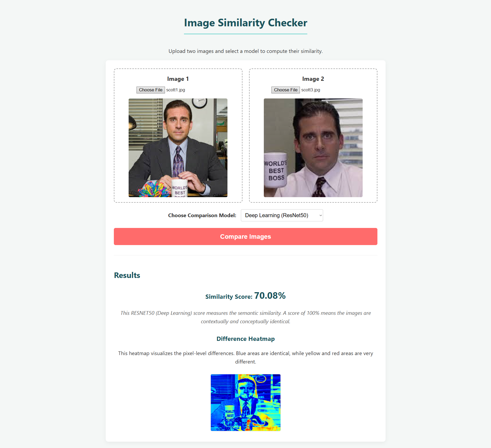
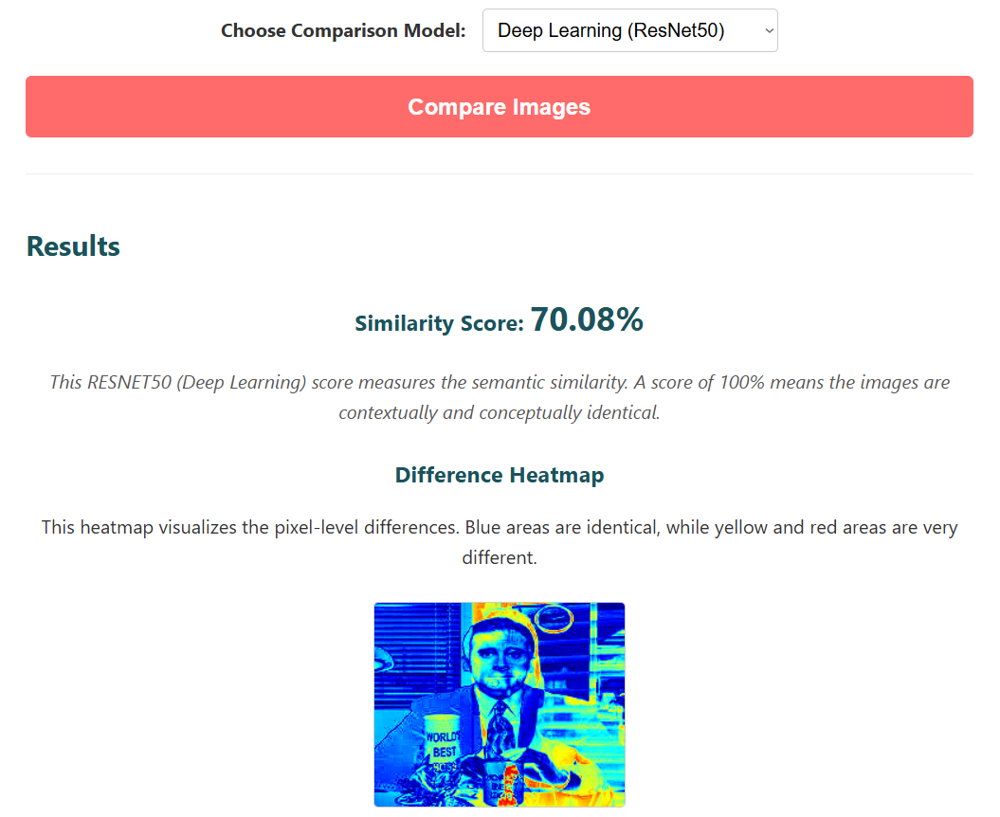
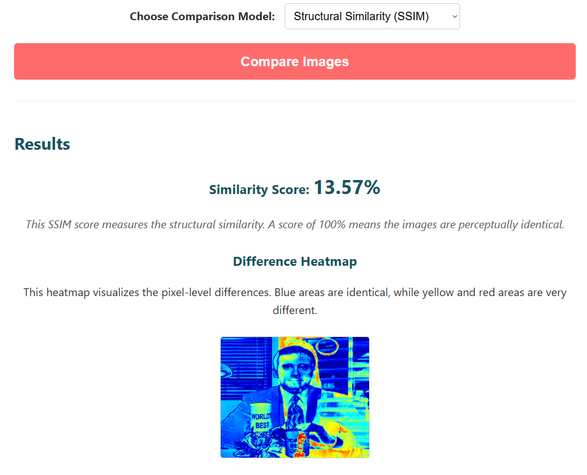

# Multi-Model Image Similarity Checker

This is a full-stack web application that enables users to upload any two images and compute their similarity using both classic image processing (SSIM) and modern deep learning (CNNs) techniques. The system displays a similarity score, a visual heatmap of the differences, and a clear explanation of the results.


---

## 🚀 Features

* **Dual Image Upload:** A clean, responsive interface to upload two images for comparison.
* **Live Image Previews:** Instantly see the images you've selected.
* **Multiple Comparison Models:** Users can select which algorithm to use:
    * **Structural Similarity (SSIM):** For pixel-level, perceptual comparison.
    * **VGG16 (Deep Learning):** For semantic content comparison.
    * **ResNet50 (Deep Learning):** A deeper, alternative CNN for content comparison.
    * **MobileNetV2 (Deep Learning):** A lightweight, fast CNN for content comparison.
* **Similarity Score:** A clear, quantitative percentage of how similar the two images are.
* **Visual Difference Heatmap:** A dynamically generated heatmap that visualizes *where* the images differ. Blue areas are identical, while yellow and red areas are very different.
* **Dynamic Explanations:** The UI provides a simple explanation of the score based on the model selected.

---

## 🖼️ Sample Results

Here are some examples of the application in action.

### Example 1: High Semantic Similarity (Deep Learning Model)

When comparing two *different* photos of the same subject, the CNN model (VGG16/ResNet50) correctly identifies high conceptual similarity, while the heatmap shows the exact areas of change.

| Image 1 | Image 2 | Results |
| :---: | :---: | :---: |
|  |  |  |


### Example 2: Low Structural Similarity (SSIM Model)

Using the *same* two images as above, the SSIM model correctly reports a **low** similarity score. This is because the pixels and structures are in different places, even though the content is the same. This demonstrates the key difference between the models.

| Image 1 | Image 2 | Results |
| :---: | :---: | :---: |
|  |  |  |

---

## 🔧 Tech Stack

* **Backend:** Python
* **Web Framework:** Flask
* **Deep Learning:** TensorFlow / Keras
* **ML & Vector Math:** Scikit-learn, NumPy
* **Image Processing:** OpenCV, Pillow (PIL), Scikit-image (skimage)
* **Frontend:** HTML, CSS, JavaScript (Vanilla)

---

## 💡 How It Works

The application uses a client-server architecture. The frontend sends the user's images to the backend, which performs the analysis and returns a JSON response.


1.  **Frontend (Client):** The user selects two images and a comparison model (e.g., "ResNet50"). They click "Compare."
2.  **API Request:** JavaScript's `fetch` API sends the image files and the model name to the `/compare` endpoint on the Flask server.
3.  **Backend (Server):**
    * The Flask app receives the files.
    * If **SSIM** is chosen, it uses `scikit-image` to calculate the structural similarity score.
    * If a **CNN Model** (like ResNet50) is chosen:
        1.  It loads the pre-trained model (with `include_top=False`) to act as a feature extractor.
        2.  It generates a feature vector (an "idea" or "scorecard") for each image.
        3.  It uses `scikit-learn`'s **Cosine Similarity** to compare the two vectors.
    * **Heatmap Generation:** `OpenCV` is used to create the visual difference heatmap.
4.  **API Response:** The server sends back a JSON object containing the `similarity_score` and the `heatmap_image` (as a Base64 string).
5.  **Frontend (Display):** JavaScript receives the JSON and dynamically updates the HTML to display the score and the heatmap.

---

## 🏁 Getting Started

Follow these instructions to get the project running on your local machine.

### 1. Prerequisites

* Python 3.8 or newer
* `pip` and `venv` (usually included with Python)

### 2. Installation & Setup

1.  **Clone the repository:**
    ```bash
    git clone [https://github.com/Dhanush-i/image_similarity_checker.git](https://github.com/Dhanush-i/image_similarity_checker.git)
    cd image_similarity_checker
    ```

2.  **Create and activate a virtual environment:**
    ```bash
    # On Windows
    python -m venv .venv
    .venv\Scripts\activate
    
    # On macOS/Linux
    python3 -m venv .venv
    source .venv/bin/activate
    ```

3.  **Install the required libraries:**
    ```bash
    pip install -r requirements.txt
    ```
    *(**Note:** If you don't have a `requirements.txt` file, you can create one with `pip freeze > requirements.txt` or just run this command):*
    ```bash
    pip install Flask flask-cors pillow numpy tensorflow opencv-python scikit-image
    ```

### 3. How to Run

1.  **Run the Backend Server:**
    Open your terminal, make sure your virtual environment is active, and run `app.py`:
    ```bash
    python app.py
    ```
    The server will start on `http://127.0.0.1:5000`. It will automatically download the pre-trained model weights from TensorFlow the first time it runs.

2.  **Run the Frontend:**
    Navigate to the project folder and simply **double-click the `index.html` file** to open it in your default web browser.

### 4. Usage

1.  Click "Choose File" under **Image 1** and select an image.
2.  Click "Choose File" under **Image 2** and select an image.
3.  Choose your desired model from the "Choose Comparison Model" dropdown.
4.  Click the **"Compare Images"** button.
5.  The results, including the score and heatmap, will appear below.

## License

This project is licensed under the MIT License - see the `LICENSE.md` file for details.
